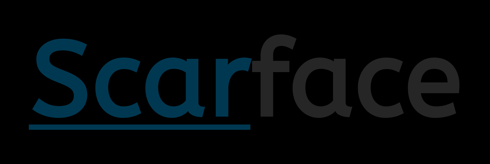

#  Scarface Framework

Social engineering and security assessment suite for authorized red-team operations, security awareness exercises, and training simulations.

---

## Overview

Scarface Framework is a toolkit that consolidates workflows commonly used in authorized red-team engagements and security awareness programs. It provides capabilities for safely replicating web assets, hosting simulation servers, designing and managing email templates, delivering controlled campaigns to consenting participants, and collecting interaction data for analysis and training.

This repository is intended for use by security professionals, educators, and organizations running authorized assessments. Use of the framework against targets without documented, mutual consent is strictly prohibited.

## Key features

- High-fidelity site replication: automated asset retrieval and URL rewriting for locally hosted replicas of target sites.
- Local server hosting & tunneling: options to host replicated sites locally (lightweight Python or PHP servers) and integrate with standard tunneling services.
- Template engine: create and customize HTML templates with variable substitution for personalized, non-malicious training content.
- Campaign delivery system: configurable SMTP client and bulk recipient support for controlled mailing to authorized test groups.
- Data capture & logging: structured capture of interactions (form submissions, access logs) with exportable reports for training and remediation.
- Extensible architecture: modular components designed to be extended or integrated into existing assessment toolchains.

## Requirements

- Python 3.8+ (or other runtime(s) indicated by the project)
- Relevant system packages for any dependencies (see requirements)
- SMTP access for campaign delivery (use a test/sandbox SMTP service when possible)
- Valid authorization and documented consent from target organization and participants

## Quick start

1. Clone the repository
   ```bash
   git clone https://github.com/zerosocialcode/Scarface.git
   cd Scarface
   ```

2. Install dependencies
   ```bash
   python -m venv venv
   source venv/bin/activate
   pip install -r requirements.txt
   ```

## Security & safe operation

- Only run campaigns and simulations against users and systems for which you have explicit, documented authorization.
- Use segregated infrastructure, test email domains, and controlled SMTP endpoints. Prefer sandbox or staging environments when possible.
- Ensure logs and captured artifacts are stored on secured systems with access controls and audit trails.

## Contributing

Contributions are welcome and should follow these guidelines:

- Open an issue to propose significant changes or report bugs.
- Create feature branches for proposed features and submit pull requests with clear descriptions and tests where applicable.
- Keep changes focused and document any configuration or operational impacts.

## License

Specify license here (e.g., MIT, Apache 2.0). Update the LICENSE file in the repository accordingly.

## Disclaimer and authorized-use policy

This software is provided for educational, defensive, and authorized security testing purposes only. The maintainers and contributors of Scarface Framework assume no liability for misuse. It is the end user's responsibility to ensure all activities comply with applicable laws and organizational policies. Use of this toolkit to target systems or users without prior documented consent is illegal and unethical.

## Contact

For questions about authorized use, deployment, or contribution, open an issue or contact the repository maintainers.
